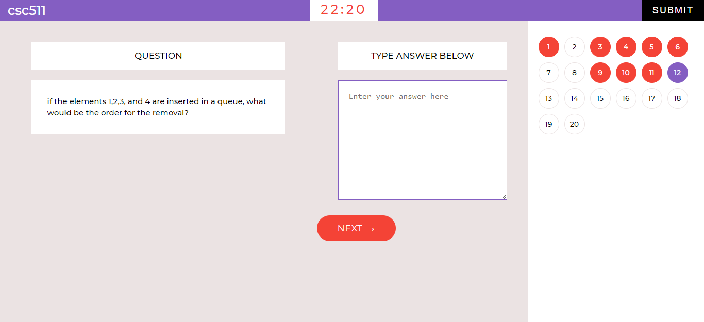

# Node Transportation

Testing students using only the multiple choice question type in Computer Based Testing is not the efficient method because it breeds more room for guess work. I now came up with a solution by building a CBT app that offers a two range of question types which are Free Text Area (fill in the blanks) and muiltiple choice question type.
 
This app enables the examiner to set questions that can include both multiple choice and free text area question type.

### <a href="https://test-taking-app.netlify.app/">Live Demo</a>

<h2>Stacks and Technologies used in Developing the App</h2>

### Frontend

&nbsp;
&nbsp;
&nbsp;
&nbsp;
&nbsp;
&nbsp;

### Backend

&nbsp;
&nbsp;
&nbsp;

 

## Available Scripts

### /backend directory

Before running the script in the /frontend make sure you run the script in the /backend first by running:

### node index.js

This will start a new local server for your app in port 5000

 

### /frontend directory

Cd into the /frontend directory and run the following scripts:

### `npm start`

Runs the app in the development mode.\
Open [http://localhost:3000](http://localhost:3000) to view it in the browser.

The page will reload if you make edits.\
You will also see any lint errors in the console.

### `npm test`

Launches the test runner in the interactive watch mode.\
See the section about [running tests](https://facebook.github.io/create-react-app/docs/running-tests) for more information.

### `npm run build`

Builds the app for production to the `build` folder.\
It correctly bundles React in production mode and optimizes the build for the best performance.

The build is minified and the filenames include the hashes.\
Your app is ready to be deployed!
